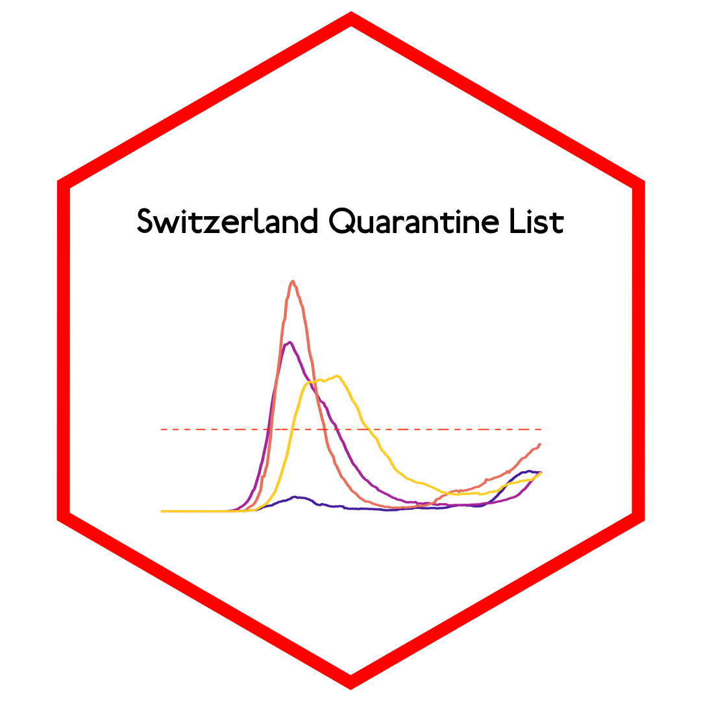
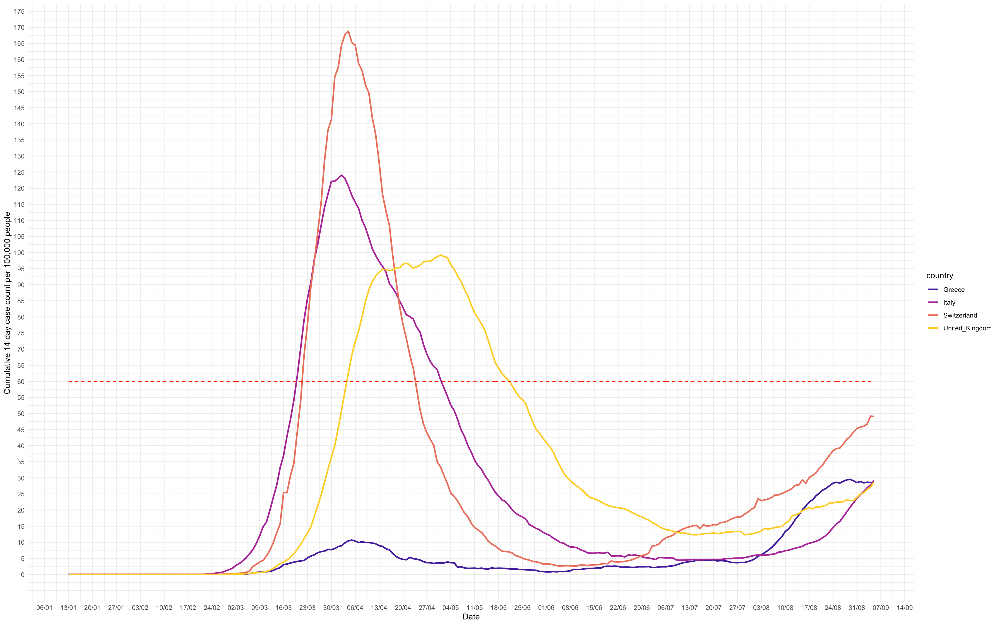

# Switzerland Quarantine List </a>

## Overview
This analysis can be used to help predict which countries will join [Switzerlands mandatory COVID-19 quarantine list](https://www.bag.admin.ch/bag/en/home/krankheiten/ausbrueche-epidemien-pandemien/aktuelle-ausbrueche-epidemien/novel-cov/empfehlungen-fuer-reisende/quarantaene-einreisende.html)

## Usage
Run the code in `country-counts.R`, filtering for countries of interest. In the output plot, the red dotted line at `y = 60` represents the threshold of a cumulative 14 day COVID-19 case rate of 60 per 100,000. This threshold is one determinant used to determine if a country should be added onto the mandatory quarantine list for Switzerland.

## Getting help
If you encounter a clear bug, please file a minimal reproducible example
in [issues](https://github.com/MikeJohnPage/switzerland-quarantine-list/issues).
