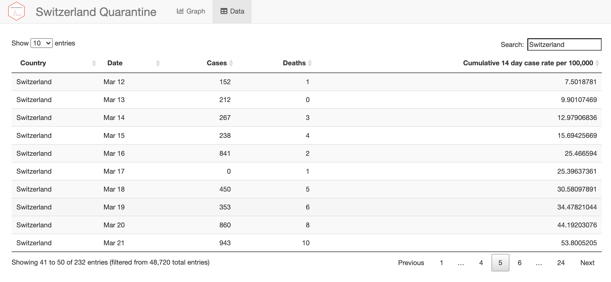

# Switzerland Quarantine List </a>

## Overview
This Shiny app can be used to help predict which countries will join [Switzerlands mandatory COVID-19 quarantine list](https://www.bag.admin.ch/bag/en/home/krankheiten/ausbrueche-epidemien-pandemien/aktuelle-ausbrueche-epidemien/novel-cov/empfehlungen-fuer-reisende/quarantaene-einreisende.html)

## Usage
Click [here](https://mikejohnpage.shinyapps.io/switzerland-quarantine-list/) to view the Shiny app. Use the graph tab to examine which countries are approaching Switzerland's quarantine threshold infection rate (currently 60 per 100,000):

Use the data tab to explore the raw data:

## Credits
All data comes from the [European Centre for Disease Prevention and Control](https://www.ecdc.europa.eu/en/publications-data/download-todays-data-geographic-distribution-covid-19-cases-worldwide)

## Getting help
If you encounter a clear bug, please file a minimal reproducible example
in [issues](https://github.com/MikeJohnPage/switzerland-quarantine-list/issues).
